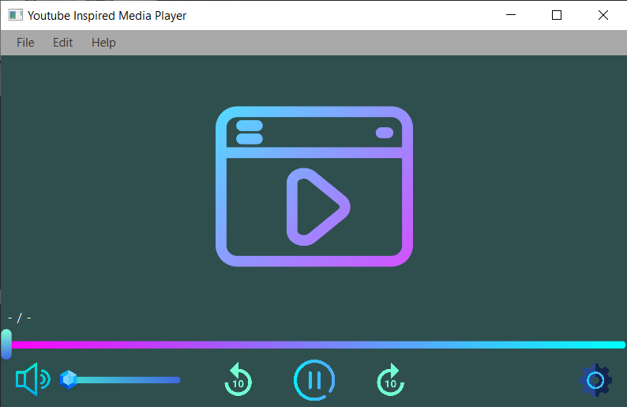

# YouTube-Inspired Media Player (JavaFX + Maven)

A lightweight JavaFX media player for audio/video with a clean, YouTube-style feel:
HUD auto-hide, keyboard shortcuts, playback speed controls, scrub preview, clamped seeking, and safe file handling — all in a simple Maven project.



---

## ✨ Features

- **Playback that feels right**
  - One-tap **Play/Pause** (double-click on video or press **Space**)
  - **Safe seeking**: ±10s with **Left/Right** arrows — always clamped to `[0, total]`
  - **Scrub preview**: while dragging the progress slider you see the **preview time**; the player only seeks when you **release**
  - **End-of-media reset**: auto-pauses and returns to **00:00** cleanly

- **Speed controls**
  - Built-in **0.5×, 0.75×, 1×, 2×** playback rates
  - “Gear” icon animates while open; rate changes pause the gear animation

- **Volume & mute, your way**
  - Slider from **0–100%** (updates the player in real time)
  - **Up/Down** arrows nudge volume by **±5%**
  - **M** toggles mute; mute/unmute **icons sync instantly**

- **HUD that behaves like YouTube**
  - **Auto-hides** after **3s** of inactivity
  - Any keyboard action or mouse move **shows the full HUD briefly** (not just one button)
  - A single master visibility flag ensures **no “orphan” buttons** appear when hidden

- **Keyboard shortcuts that always work**
  - Handled with a **Scene event filter**, so shortcuts fire even if a control (like the slider) has focus  
  - `Space` play/pause · `←/→` −/+10s · `↑/↓` volume ±5% · `M` mute · `F` full screen

- **File handling that won’t bite**
  - **Cancel-safe** file chooser (no NPEs if you close it)
  - Remembers your **last opened folder** (Java Preferences)
  - Disposes the previous `MediaPlayer` before loading a new one
  - Window title updates to the **current filename**

- **Video sizing that stays put**
  - `MediaView` is bound to the window size and keeps a consistent layout
  - Overlay icon is centered over the exact **video region**, so it always looks aligned

- **Solid defaults, no surprises**
  - Clean **time formatting** (`HH:MM:SS` or `MM:SS`, no rollover bugs)
  - **Error logging** to console for media issues

---

## ⌨️ Keyboard & Mouse Shortcuts

| Action                 | Shortcut / Gesture         |
|------------------------|----------------------------|
| Play / Pause           | `Space` or **double-click video** |
| Seek forward / back    | `Right` / `Left` (±10s, clamped) |
| Volume up / down       | `Up` / `Down` (±5%)        |
| Mute / Unmute          | `M`                        |
| Full screen toggle     | `F`                        |
---

## 🚀 Getting Started

### Requirements
- **JDK 17+** (LTS recommended)
- **Maven 3.8+**
- **JavaFX 17+** dependencies (managed via Maven in this project)

### Run (Dev)
```bash
mvn clean javafx:run
```

### Build (Jar)
If you have a shaded or launcher setup in your `pom.xml`, you can:

```bash
mvn clean package
```

If you're not using a shaded executable JAR, prefer `mvn javafx:run` for development.

### IDE
* IntelliJ IDEA / VS Code / Eclipse: Import as a Maven project and run the `javafx:run` goal.

---

## 📂 Project Structure (key files)

```
.
├─ src/main/java/com/mycompany/mediaplayer/
│  ├─ App.java
│  ├─ PrimaryController.java
├─ src/main/resources/
│  ├─ primary.fxml
│  ├─ Style.css
│  └─ mediaPlayerIcon.png
├─ Screenshots/
│  └─ mediaPlayer.PNG
├─ pom.xml
└─ .gitignore
```

---

## 🛣️ Roadmap (nice-to-haves)

* Remember last playback position per file
* Drag-and-drop a media file to open
* Subtitles (SRT/VTT) loading
* Unit tests for utility methods (e.g., time formatting)

---

## 📜 License

MIT — feel free to use and adapt..
